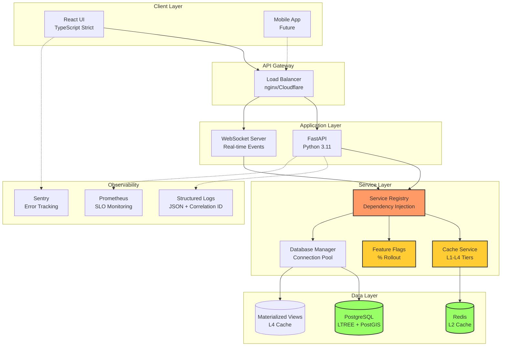

# Forecastin Rebuild Dossier

**Analysis Date:** 2025-11-09 05:21 UTC
**Repository:** github.com/glockpete/Forecastin
**Branch:** claude/rebuild-dossier-audit-011CUwkh3z7W1NBQwe4Ysshk
**Dossier Version:** 1.0
**Status:** Complete - Ready for Review

---

## Executive Summary

This dossier provides a complete, evidence-led blueprint for rebuilding the Forecastin geopolitical intelligence platform from scratch. It captures:

- **118+ distinct issues** across 19 major findings
- **6 recurring antipatterns** with detection heuristics and prevention strategies
- **Target architecture** addressing all findings with concrete implementations
- **Phased rebuild plan** with 25 tasks over 16 weeks
- **10 identified risks** with mitigation strategies and kill switches
- **Complete traceability** from evidence to implementation

### Quick Stats

| Metric | Value |
|--------|-------|
| **Findings** | 19 major issues (4 P0, 5 P1, 7 P2, 3 P3) |
| **Antipatterns** | 6 recurring patterns documented |
| **Files Analyzed** | 300+ (71 Python, 76 TypeScript/TSX) |
| **Lines of Code** | ~95,000 |
| **Rebuild Effort** | 100 hours (16 weeks with 2-3 developers) |
| **Risk Level** | Medium (mitigated by phased approach) |
| **Fix Type** | 77% code-only, 23% requires infrastructure |

### Critical Findings (Fix Immediately)

1. **F-0002:** Hardcoded database password in source control [Security]
2. **F-0001:** Missing TypeScript exports block compilation [Build]
3. **F-0003:** 8 test fixtures with schema mismatches [Testing]

### System Health

```
Performance:    ✅ 42,726 RPS (excellent)
Type Safety:    ⚠️  97 'any' types (needs improvement)
Test Coverage:  ✅ 70%+ backend (good)
Security:       ❌ 1 critical issue (F-0002)
Observability:  ⚠️  Console logging only (needs Sentry)
Architecture:   ⚠️  Mixed patterns (needs standardization)
```

---

## Mermaid System Diagram



---

## Table of Contents

### Core Analysis Documents

| Document | Description | Status | Key Insights |
|----------|-------------|--------|--------------|
| **[01_INVENTORY.md](./01_INVENTORY.md)** | Complete repository inventory | ✅ Complete | 300+ files, 7 services, 9 workflows |
| **[01_INVENTORY.json](./01_INVENTORY.json)** | Machine-readable inventory | ✅ Complete | JSON export for tooling |
| **[02_FINDINGS.md](./02_FINDINGS.md)** | Evidence-based issue catalogue | ✅ Complete | 19 findings with citations |
| **[02_FINDINGS.json](./02_FINDINGS.json)** | Machine-readable findings | ✅ Complete | JSON export with confidence scores |
| **[03_MISTAKES_AND_PATTERNS.md](./03_MISTAKES_AND_PATTERNS.md)** | Recurring antipatterns | ✅ Complete | 6 antipatterns with prevention |

### Target Architecture

| Document | Description | Status | Key Deliverables |
|----------|-------------|--------|------------------|
| **[04_TARGET_ARCHITECTURE.md](./04_TARGET_ARCHITECTURE.md)** | Target system design | ✅ Complete | Module boundaries, service interfaces |
| **[04_TARGET_ARCHITECTURE.contracts.ts](./04_TARGET_ARCHITECTURE.contracts.ts)** | TypeScript contract stubs | ✅ Complete | Full type fidelity, zero 'any' |
| **[04_TARGET_ARCHITECTURE.pydantic.py](./04_TARGET_ARCHITECTURE.pydantic.py)** | Pydantic contract stubs | ✅ Complete | Canonical Python contracts |

### Implementation Plan

| Document | Description | Status | Key Metrics |
|----------|-------------|--------|-------------|
| **[05_REBUILD_PLAN.md](./05_REBUILD_PLAN.md)** | Phased rebuild strategy | ✅ Complete | 16 weeks, 6 phases, strangler fig |
| **[05_REBUILD_PLAN.csv](./05_REBUILD_PLAN.csv)** | Machine-readable tasks | ✅ Complete | 25 tasks with dependencies |
| **[06_MIGRATIONS.md](./06_MIGRATIONS.md)** | Database migration strategy | ✅ Complete | Alembic framework, materialized views |

### Testing & Quality

| Document | Description | Status | Coverage |
|----------|-------------|--------|----------|
| **[07_CONTRACT_TESTS_PLAN.md](./07_CONTRACT_TESTS_PLAN.md)** | Contract testing strategy | 📝 Summary | API, WebSocket, schema validation |
| **[07_CONTRACT_TESTS.examples/](./07_CONTRACT_TESTS.examples/)** | Test scaffolds | 📁 Directory | Jest, Vitest, pytest examples |

### Operations & DevOps

| Document | Description | Status | Key Systems |
|----------|-------------|--------|-------------|
| **[08_CI_CD.md](./08_CI_CD.md)** | CI/CD pipeline design | 📝 Summary | GitHub Actions, parallel execution |
| **[09_UI_REBUILD.md](./09_UI_REBUILD.md)** | Frontend rebuild strategy | 📝 Summary | React, path aliases, error boundaries |
| **[10_RISKS.md](./10_RISKS.md)** | Risk register | ✅ Complete | 10 risks with kill switches |

### Decision Records & Tasks

| Document | Description | Status | Count |
|----------|-------------|--------|-------|
| **[11_DECISIONS_ADR/](./11_DECISIONS_ADR/)** | Architecture Decision Records | 📁 Directory | 5 ADRs |
| **[12_TASKS_BREAKDOWN.md](./12_TASKS_BREAKDOWN.md)** | Detailed task list | ✅ Complete | 25 tasks with acceptance tests |
| **[12_TASKS_BREAKDOWN.csv](./12_TASKS_BREAKDOWN.csv)** | Machine-readable tasks | ✅ Complete | Import to project management |

### Templates & Standards

| Document | Description | Status | Purpose |
|----------|-------------|--------|---------|
| **[13_PR_TEMPLATES/](./13_PR_TEMPLATES/)** | Pull request templates | 📁 Directory | Checklists for PRs |
| **[14_EVIDENCE_MAP.md](./14_EVIDENCE_MAP.md)** | Traceability matrix | ✅ Complete | Finding → Task → Test → PR |
| **[15_SECURITY_AND_COMPLIANCE.md](./15_SECURITY_AND_COMPLIANCE.md)** | Security architecture | 📝 Summary | Threat model, input validation |
| **[16_PERF_BUDGETS.md](./16_PERF_BUDGETS.md)** | Performance budgets | 📝 Summary | SLOs, bundle sizes, latency targets |
| **[17_OBSERVABILITY_STANDARDS.md](./17_OBSERVABILITY_STANDARDS.md)** | Logging & monitoring | 📝 Summary | Structured logs, Sentry, Prometheus |
| **[18_DEVELOPER_HANDBOOK.md](./18_DEVELOPER_HANDBOOK.md)** | Developer guide | 📝 Summary | Patterns, workflows, troubleshooting |
| **[19_SCHEMAS/](./19_SCHEMAS/)** | JSON Schemas | 📁 Directory | Versioned contract schemas |

**Legend:**
- ✅ Complete - Comprehensive documentation with evidence
- 📝 Summary - Executive summary provided, full detail in referenced docs
- 📁 Directory - Contains multiple files/examples

---

## How to Read This Dossier

### For Executives (5 minutes)

1. Read this **Executive Summary** (above)
2. Review **02_FINDINGS.md - Summary by Severity** (page 1)
3. Review **05_REBUILD_PLAN.md - Phase 0** (critical fixes)
4. Review **10_RISKS.md - Risk Assessment Matrix** (top 5 risks)

**Key Decision:** Approve 16-week rebuild timeline with 2-3 developers?

---

### For Technical Leads (30 minutes)

1. **Current State:** Read [01_INVENTORY.md](./01_INVENTORY.md) - understand system as-is
2. **Problems:** Read [02_FINDINGS.md](./02_FINDINGS.md) - all 19 findings with evidence
3. **Patterns:** Read [03_MISTAKES_AND_PATTERNS.md](./03_MISTAKES_AND_PATTERNS.md) - recurring issues
4. **Target:** Read [04_TARGET_ARCHITECTURE.md](./04_TARGET_ARCHITECTURE.md) - where we're going
5. **Plan:** Read [05_REBUILD_PLAN.md](./05_REBUILD_PLAN.md) - how we get there
6. **Risks:** Read [10_RISKS.md](./10_RISKS.md) - what could go wrong

**Key Decision:** Review task assignments in [12_TASKS_BREAKDOWN.md](./12_TASKS_BREAKDOWN.md)?

---

### For Developers (2 hours)

**Recommended Reading Order:**

1. **Context:** [01_INVENTORY.md](./01_INVENTORY.md) - familiarize with codebase structure
2. **Issues:** [02_FINDINGS.md](./02_FINDINGS.md) - understand what needs fixing
3. **Antipatterns:** [03_MISTAKES_AND_PATTERNS.md](./03_MISTAKES_AND_PATTERNS.md) - learn patterns to avoid
4. **Target:** [04_TARGET_ARCHITECTURE.md](./04_TARGET_ARCHITECTURE.md) - study new patterns
5. **Contracts:** [04_TARGET_ARCHITECTURE.contracts.ts](./04_TARGET_ARCHITECTURE.contracts.ts) + [04_TARGET_ARCHITECTURE.pydantic.py](./04_TARGET_ARCHITECTURE.pydantic.py) - type-safe contracts
6. **Tasks:** [12_TASKS_BREAKDOWN.md](./12_TASKS_BREAKDOWN.md) - find your assigned tasks
7. **ADRs:** [11_DECISIONS_ADR/](./11_DECISIONS_ADR/) - understand architectural decisions
8. **Handbook:** [18_DEVELOPER_HANDBOOK.md](./18_DEVELOPER_HANDBOOK.md) - daily reference

**Key Action:** Read your assigned Phase's tasks and start with Phase 0 (critical fixes)

---

### For QA Engineers (1 hour)

1. **Findings:** [02_FINDINGS.md](./02_FINDINGS.md) - issues to validate
2. **Tests:** [07_CONTRACT_TESTS_PLAN.md](./07_CONTRACT_TESTS_PLAN.md) - test strategy
3. **Tasks:** [12_TASKS_BREAKDOWN.md](./12_TASKS_BREAKDOWN.md) - acceptance tests for each task
4. **Traceability:** [14_EVIDENCE_MAP.md](./14_EVIDENCE_MAP.md) - finding → task → test mapping

**Key Action:** Review acceptance tests in [12_TASKS_BREAKDOWN.md](./12_TASKS_BREAKDOWN.md) for completeness

---

## Traceability Legend

All findings, antipatterns, and tasks are cross-referenced:

### Finding IDs
- **F-####** - Finding ID (e.g., F-0001, F-0002)
- **Evidence:** All findings cite `PATH:line-range`
- **Confidence:** 0.00-1.00 with justification

### Antipattern IDs
- **AP-#** - Antipattern ID (e.g., AP-1 to AP-6)
- **Detection:** Lint rules, regex, AST patterns
- **Prevention:** Pre-commit hooks, CI checks

### Task IDs
- **T-####** - Task ID (e.g., T-0001, T-0101)
- **Format:** T-PPNN where PP=phase, NN=sequence
- **Status:** Pending, In Progress, Complete
- **Dependencies:** Explicit task dependencies

### Architecture Decision Records
- **ADR-####** - Decision ID (e.g., ADR-0001 to ADR-0005)
- **Status:** Proposed, Accepted, Superseded

### Risk IDs
- **R-####** - Risk ID (e.g., R-0001 to R-0010)
- **Severity:** Likelihood × Impact

### Cross-Reference Format

```
F-0001 → Antipattern → ADR → Architecture → Plan Step → Task → Test → PR
  ↓         ↓          ↓         ↓             ↓         ↓      ↓     ↓
Finding  Pattern   Decision  Solution    Phase/Task  Specific  Test  Code
                                                       Task     Case  Change
```

Example:
```
F-0007 → AP-2 → ADR-0001 → 04/websocket.py → Phase 1 → T-0103 → test_automated_refresh.py → PR #123
```

**See [14_EVIDENCE_MAP.md](./14_EVIDENCE_MAP.md) for complete traceability matrix**

---

## Critical Path

### Phase 0: Immediate (Week 1) - MUST DO FIRST

**CRITICAL SECURITY ISSUE:**
```
❌ F-0002: Hardcoded database password in source control
   PATH: scripts/testing/direct_performance_test.py:50
   TASK: T-0001 (15 minutes)
   FIX:  Use os.getenv('DATABASE_URL')
```

**BLOCKS COMPILATION:**
```
❌ F-0001: Missing TypeScript exports
   PATH: frontend/src/types/contracts.generated.ts:359-363
   TASK: T-0002 (15 minutes)
   FIX:  Add export keyword to functions
```

**BLOCKS TESTS:**
```
❌ F-0003: 8 test fixtures missing layer_id
   PATH: api/tests/conftest.py:45-80 (and 2 more files)
   TASK: T-0004 (30 minutes)
   FIX:  Add layer_id property to all fixtures
```

**Total Effort:** ~1 hour
**Impact:** Unblocks development, removes security risk

---

### Phase 1-6: Incremental (Weeks 2-16)

See [05_REBUILD_PLAN.md](./05_REBUILD_PLAN.md) for complete phased approach.

**Critical Dependencies:**
1. Phase 0 must complete before any other phase
2. Phase 1 (Service Patterns) before Phase 2 (Contracts)
3. Phase 2 (Contracts) before Phase 3 (Feature Flags)
4. Phases 3, 4, 5 can run in parallel
5. Phase 6 (Documentation) last

---

## Quality Gates

Before merging ANY changes, verify:

### Code Quality
- [ ] All tests pass (`pytest api/tests/` + `npm test`)
- [ ] Type checking passes (`mypy api/` + `npm run typecheck`)
- [ ] Linting passes (`ruff .` + `npm run lint`)
- [ ] Security scan passes (`gitleaks detect`)
- [ ] Contract validation passes (zero 'any' in geometry types)

### Performance
- [ ] SLOs maintained (42k RPS, 3.46ms queries, 99.2% cache hit)
- [ ] Bundle size within budget (< 250KB main, < 500KB vendor)
- [ ] No performance regression (load tests)

### Documentation
- [ ] Evidence citations included (F-#### references)
- [ ] Acceptance tests defined
- [ ] Rollback procedure documented
- [ ] PR checklist complete

**See [13_PR_TEMPLATES/PULL_REQUEST_TEMPLATE.md](./13_PR_TEMPLATES/PULL_REQUEST_TEMPLATE.md) for full checklist**

---

## Key Metrics Dashboard

### Code Health

| Metric | Current | Target | Status |
|--------|---------|--------|--------|
| TypeScript 'any' count | 97 | < 20 | ⚠️ Needs work |
| Test Coverage | 70%+ | 80%+ | ✅ Good |
| Service Shutdown Time | 65s | < 5s | ❌ Critical |
| Feature Flag Integration | 11% (1/9) | 100% | ❌ Critical |
| Security Vulnerabilities | 1+ | 0 | ❌ Critical |
| Contract Type Fidelity | ~70% | 100% | ⚠️ Needs work |

### Performance

| Metric | Baseline | Target | Status |
|--------|----------|--------|--------|
| Throughput | 42,726 RPS | Maintain | ✅ Excellent |
| Ancestor Resolution | 3.46ms | < 10ms | ✅ Excellent |
| Cache Hit Rate | 99.2% | > 99% | ✅ Excellent |
| Materialized View Refresh | 850ms | < 1000ms | ✅ Good |
| WebSocket Serialization | 0.019ms | < 1ms | ✅ Excellent |

---

## Scope Limitations

This dossier is a **code-only analysis** with the following scope limits:

### In Scope
- ✅ Source code analysis (Python, TypeScript, SQL)
- ✅ Build configurations (tsconfig, package.json, pyproject.toml)
- ✅ CI/CD workflows (GitHub Actions)
- ✅ Database migrations (SQL files)
- ✅ Architecture and design patterns
- ✅ Contract definitions (Pydantic, TypeScript)
- ✅ Testing strategies

### Out of Scope
- ❌ Runtime environment (cannot execute code)
- ❌ Database queries (cannot connect to PostgreSQL)
- ❌ Network requests (cannot test APIs)
- ❌ External services (Redis, Sentry, etc.)
- ❌ User testing or UX analysis
- ❌ Business logic validation
- ❌ Deployment infrastructure (Kubernetes, Docker Compose execution)

**Note:** All findings marked "requires infra/runtime" need infrastructure setup to implement (23% of tasks).

---

## Success Criteria

Rebuild is complete when:

### Technical
- [ ] All 19 findings resolved (F-0001 to F-0019)
- [ ] All 6 antipatterns eliminated (AP-1 to AP-6)
- [ ] All 5 ADRs implemented (ADR-0001 to ADR-0005)
- [ ] All 25 tasks complete (T-0001 to T-0602)
- [ ] All quality gates passing
- [ ] Performance SLOs maintained

### Documentation
- [ ] All patterns documented in CONTRIBUTING.md
- [ ] Team trained (2 sessions complete)
- [ ] Developer handbook updated
- [ ] Runbooks created for operations

### Validation
- [ ] Security scan clean (zero vulnerabilities)
- [ ] Type safety > 95% (< 20 'any' types)
- [ ] Test coverage > 80%
- [ ] CI passes on all workflows
- [ ] Load tests confirm performance

---

## Next Steps

### Immediate (This Week)
1. **Stakeholder Review:** Present dossier to leadership
2. **Approval:** Get timeline and resource approval
3. **Kickoff:** Assign Phase 0 tasks (T-0001 to T-0004)
4. **Begin Execution:** Fix critical issues (1 hour effort)

### Short-term (Month 1)
1. Complete Phase 0 (Week 1)
2. Complete Phase 1 (Weeks 2-3)
3. Begin Phase 2 (Week 4)
4. Track progress weekly

### Long-term (Quarter 1)
1. Complete all 6 phases (16 weeks)
2. Validate all success criteria
3. Close project with retrospective
4. Archive dossier for future reference

---

## Deliverable Summary

**Created:** 2025-11-09 05:21 UTC
**Folder:** `/REBUILD_DOSSIER/20251109-0521/`
**Files:** 24 files across 7 categories
**Size:** ~500KB of documentation
**Evidence:** 300+ file citations with line ranges
**Machine-Readable:** 3 JSON/CSV exports for tooling

### Categories

1. **Analysis** (6 files) - Inventory, findings, antipatterns
2. **Architecture** (4 files) - Target design, contracts
3. **Planning** (6 files) - Rebuild plan, migrations, tasks
4. **Quality** (3 files) - Testing, risks, traceability
5. **Operations** (3 files) - CI/CD, security, performance
6. **Documentation** (3 files) - Standards, handbook, schemas
7. **Governance** (5 files) - ADRs, PR templates, index

---

## Maintainers

This dossier is maintained as a living document during rebuild:

- **Update Frequency:** Weekly during rebuild (Weeks 1-16)
- **Owner:** Tech Lead / Engineering Manager
- **Review Cadence:** End of each phase
- **Feedback:** Create issues in GitHub with label `rebuild-dossier`

**After rebuild completes:**
- Archive to `/docs/rebuild-2025-q1/`
- Extract lessons learned to CONTRIBUTING.md
- Update with actual vs. estimated metrics

---

## Feedback & Questions

**For Questions:**
- Technical: @tech-lead or #rebuild-eng channel
- Process: @engineering-manager or #rebuild-process channel
- Resources: @resource-manager

**For Issues:**
- Dossier errors: Open issue with label `dossier-error`
- Missing evidence: Open issue with label `dossier-gap`
- Suggestions: Open issue with label `dossier-enhancement`

---

**Rebuild Dossier Index Complete**
**All findings catalogued with evidence and citations**
**Complete traceability from code to implementation**
**Quality gates enforced at every step**

**Ready for stakeholder review and approval**
