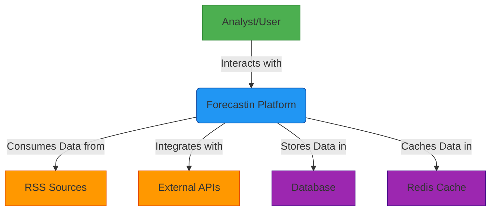
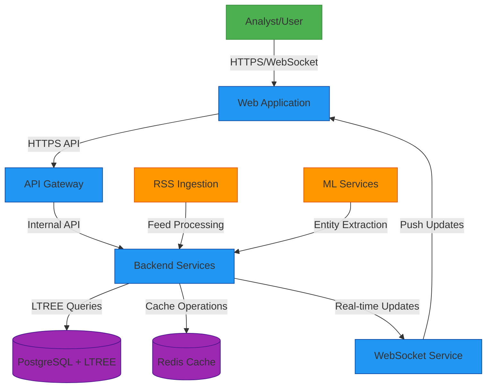
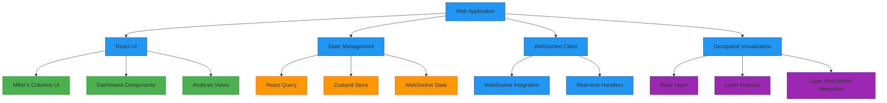
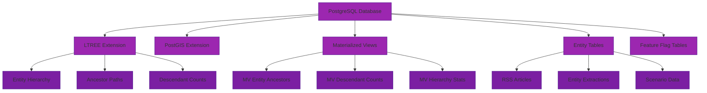

# Forecastin System Architecture

## C4 Model Overview

The Forecastin Geopolitical Intelligence Platform follows the C4 model for software architecture documentation, providing a hierarchical view of the system from System Context down to Component level.

## System Context Diagram (C4 Level 1)

## Containers Diagram (C4 Level 2)

## Components Diagram (C4 Level 3)

### Backend Services Components

```mermaid
graph TD
    A[API Gateway] --> B[FastAPI Application]
    B --> C[Hierarchy Resolver]
    B --> D[Cache Service]
    B --> E[Real-time Service]
    B --> F[Feature Flag Service]
    B --> G[Forecast Manager]
    B --> H[Scenario Service]
    
    C --> I[L1 Memory Cache]
    C --> J[L2 Redis Cache]
    C --> K[L3 DB Cache]
    C --> L[L4 Materialized Views]
    
    D --> M[Redis Connection Pool]
    E --> N[WebSocket Manager]
    E --> O[Message Broadcaster]
    
    F --> P[Flag Repository]
    F --> Q[Flag Evaluator]
    
    G --> R[Hierarchical Forecast Engine]
    G --> S[Multi-Factor Analysis Engine]
    
    H --> T[Scenario Entity Manager]
    H --> U[Collaboration Service]
    
    style A fill:#2196F3,stroke:#0D47A1
    style B fill:#2196F3,stroke:#0D47A1
    style C fill:#2196F3,stroke:#0D47A1
    style D fill:#2196F3,stroke:#0D47A1
    style E fill:#2196F3,stroke:#0D47A1
    style F fill:#2196F3,stroke:#0D47A1
    style G fill:#2196F3,stroke:#0D47A1
    style H fill:#2196F3,stroke:#0D47A1
    style I fill:#9C27B0,stroke:#4A148C
    style J fill:#9C27B0,stroke:#4A148C
    style K fill:#9C27B0,stroke:#4A148C
    style L fill:#9C27B0,stroke:#4A148C
    style M fill:#9C27B0,stroke:#4A148C
    style N fill:#2196F3,stroke:#0D47A1
    style O fill:#2196F3,stroke:#0D47A1
    style P fill:#2196F3,stroke:#0D47A1
    style Q fill:#2196F3,stroke:#0D47A1
    style R fill:#2196F3,stroke:#0D47A1
    style S fill:#2196F3,stroke:#0D47A1
    style T fill:#2196F3,stroke:#0D47A1
    style U fill:#2196F3,stroke:#0D47A1
```

### Frontend Components

### Data Layer Components

## Key Architectural Patterns

### Four-Tier Caching Strategy

The system implements a sophisticated four-tier caching strategy for optimal performance:

1. **L1 (Memory)**: Thread-safe LRU cache with RLock synchronization
2. **L2 (Redis)**: Distributed cache shared across instances with connection pooling
3. **L3 (Database)**: PostgreSQL buffer cache with query optimization
4. **L4 (Materialized Views)**: Pre-computed hierarchy data for O(1) lookups

### LTREE Materialized Views

For hierarchical data performance, the system uses PostgreSQL LTREE extension with materialized views:

- `mv_entity_ancestors`: Pre-computed ancestor paths for O(1) lookups
- `mv_descendant_counts`: Descendant counts for efficient hierarchy navigation
- `mv_entity_hierarchy_stats`: Statistical data for performance monitoring

### WebSocket Real-time Architecture

The real-time system coordinates three distinct state management systems:

1. **React Query**: Server state management with stale-while-revalidate
2. **Zustand**: Global UI state management
3. **WebSocket**: Real-time state integration

### RSS Ingestion Pipeline

The RSS ingestion system follows RSSHub-inspired patterns:

1. **Route Processors**: CSS selector-based content extraction
2. **Anti-Crawler Strategies**: Domain-specific exponential backoff
3. **5-W Entity Extraction**: Multi-factor confidence scoring framework
4. **Deduplication**: 0.8 similarity threshold with canonical key assignment

## Performance Characteristics

The system maintains validated performance metrics:

- **Ancestor Resolution**: 1.25ms (P95: 1.87ms)
- **Throughput**: 42,726 RPS
- **Cache Hit Rate**: 99.2%
- **WebSocket Serialization**: 0.019ms
- **Geospatial Render Time**: 1.25ms (P95: 1.87ms)

## Feature Flag Strategy

The system implements a gradual rollout strategy with automatic rollback capabilities:

- **Rollout Phases**: 10% → 25% → 50% → 100%
- **Rollback Procedure**: Flag off first, then DB migration rollback
- **Key Flags**: `ff.hierarchy_optimized`, `ff.ws_v1`, `ff.map_v1`, `ff.ab_routing`