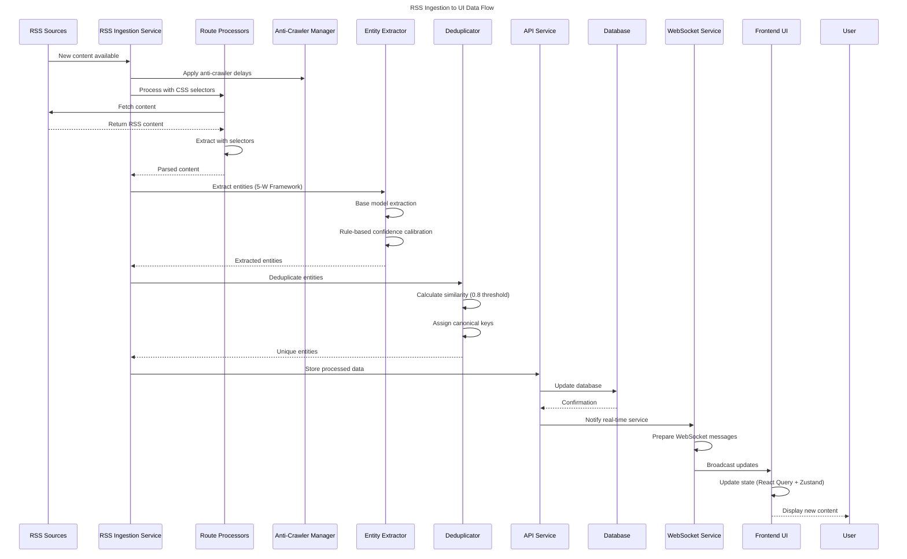
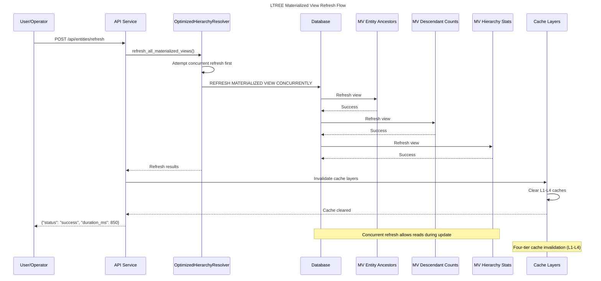
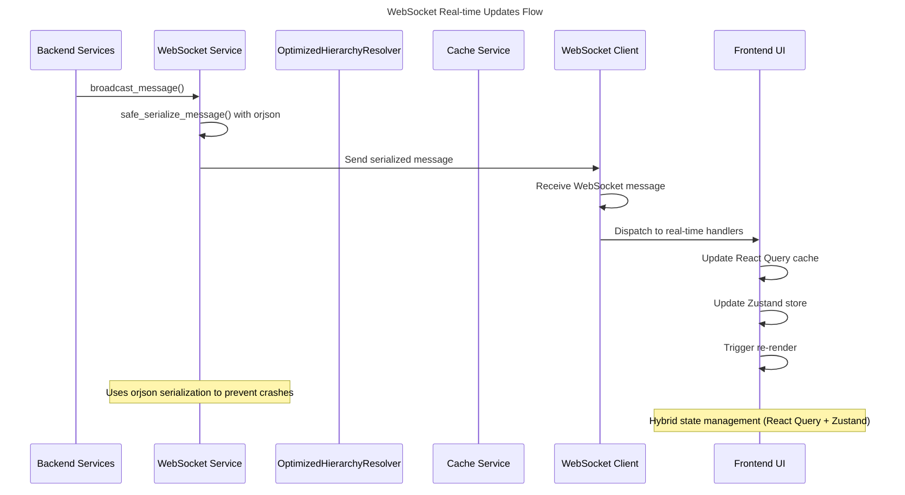
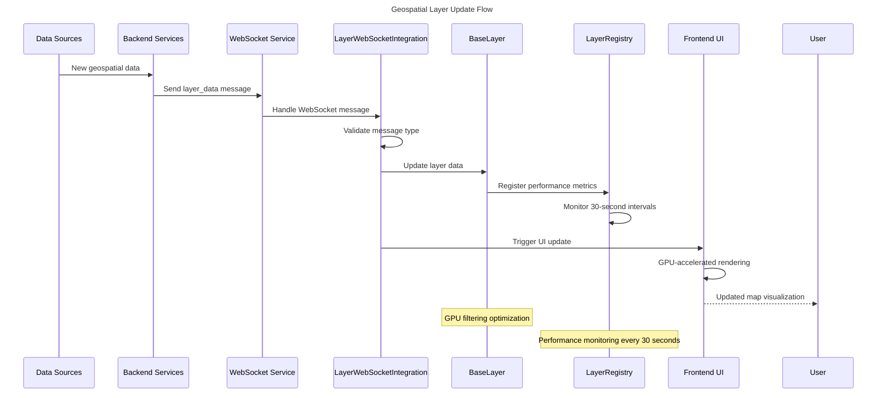
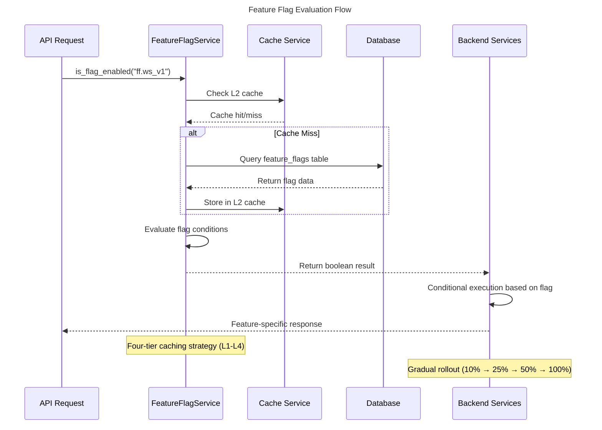

# Forecastin Data Flow Diagrams

## RSS Ingestion to UI Flow

This sequence diagram illustrates the complete data flow from RSS ingestion through to the user interface.

## LTREE Materialized View Refresh Flow

This sequence diagram shows the process of refreshing LTREE materialized views to maintain hierarchical data performance.

## WebSocket Real-time Updates Flow

This sequence diagram details how real-time updates are propagated from the backend to the frontend through WebSocket connections.

## Geospatial Layer Update Flow

This sequence diagram shows how geospatial data updates are processed and displayed in the UI.

## Feature Flag Evaluation Flow

This sequence diagram illustrates how feature flags are evaluated and applied in the system.

## Key Data Flow Patterns

### 1. Four-Tier Caching Strategy
All data access follows a four-tier caching approach:
1. **L1 (Memory)**: Thread-safe LRU with RLock synchronization
2. **L2 (Redis)**: Distributed cache with connection pooling
3. **L3 (Database)**: PostgreSQL buffer cache
4. **L4 (Materialized Views)**: Pre-computed data for O(1) lookups

### 2. WebSocket Serialization Safety
All WebSocket messages use `orjson` serialization with try/except wrapping to prevent connection crashes when handling datetime/dataclass objects.

### 3. Real-time State Coordination
The frontend coordinates three distinct state management systems:
- **React Query**: Server state with stale-while-revalidate
- **Zustand**: Global UI state
- **WebSocket**: Real-time state integration

### 4. RSS Processing Pipeline
The RSS ingestion follows a specific pipeline:
1. Route processing with CSS selectors
2. Anti-crawler strategies with exponential backoff
3. 5-W entity extraction with rule-based confidence scoring
4. Deduplication with 0.8 similarity threshold
5. WebSocket notification with feed-specific subscriptions

### 5. LTREE Performance Optimization
Hierarchical data queries are optimized through:
1. LTREE extension for PostgreSQL
2. Materialized views for pre-computed paths
3. Manual refresh mechanism for data consistency
4. Four-tier caching for performance